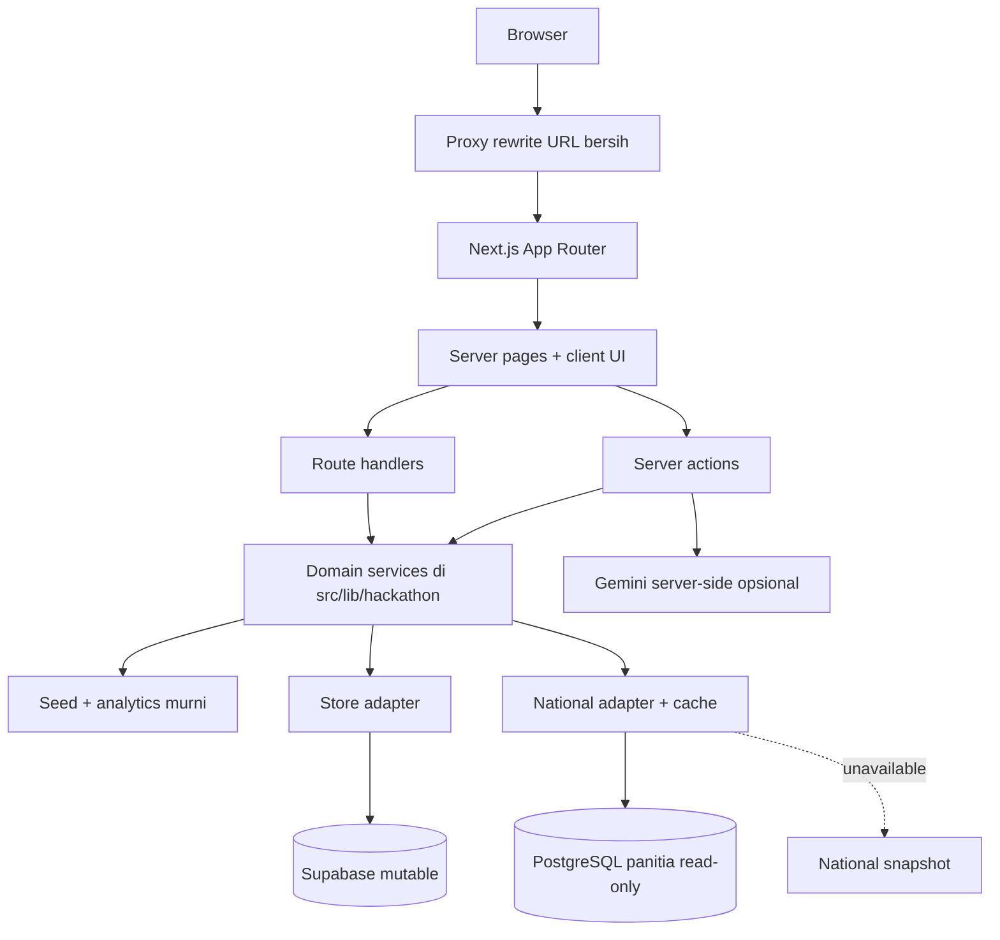
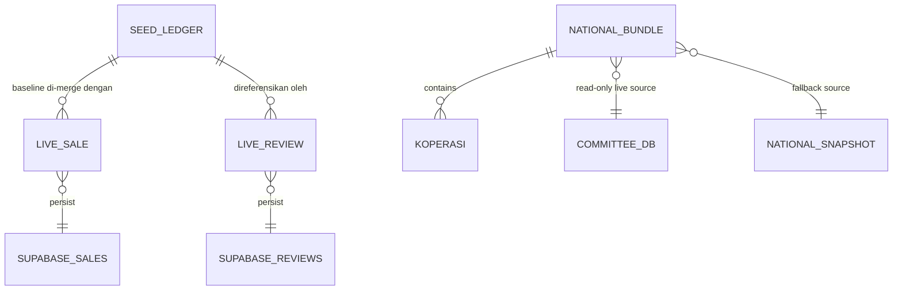
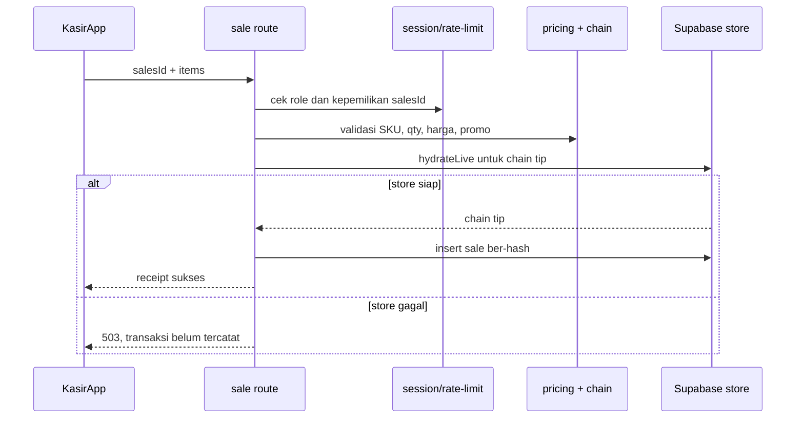
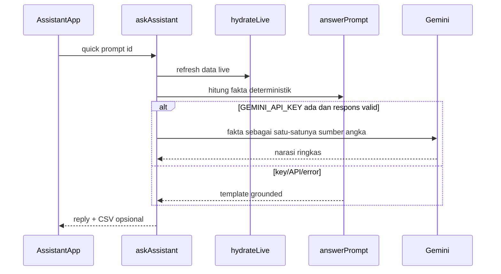

# App Architecture — NALAR × SAKSI

Dokumen ini menjelaskan batas layer, kontrak runtime, dan keputusan arsitektur aplikasi. Untuk diagram produk, data flow, dan user flow, lihat [ARCHITECTURE.md](./ARCHITECTURE.md). Untuk setup operasional, lihat [WALKTHROUGH.md](./WALKTHROUGH.md).

## Tujuan dan batas sistem

NALAR × SAKSI adalah satu microsite Next.js dengan dua domain data yang sengaja dipisahkan:

- **Operasional gerai**: seed deterministik sebagai baseline; Supabase menampung transaksi POS dan ulasan yang mutable.
- **Monitoring nasional**: PostgreSQL panitia hanya dibaca; snapshot tertanam menjaga layar nasional tetap usable saat sumber tidak tersedia.

Tidak ada endpoint aplikasi yang boleh menulis ke database panitia.

## Layer dan aturan dependensi

| Layer | Lokasi | Boleh bergantung pada | Tidak boleh melakukan |
|---|---|---|---|
| Routing/shell | `src/app`, `src/proxy.ts` | UI, server action, domain service | Query external service langsung dari client component |
| UI client | `*App.tsx`, form, chart, map | props serializable, API route, server action | Membaca secret atau service-role key |
| API boundary | `src/app/api/hackathon/*` | session, rate limiter, domain/store | Mempercayai harga, role, atau total dari client |
| Server action | `*/actions.ts` | session/domain/store | Mengirim secret ke browser |
| Domain | `src/lib/hackathon/*` | seed, store, adapter DB | Impor React/komponen UI |
| Persistence adapter | `store.ts`, `db.ts`, `supabase.ts` | SDK Supabase/`pg`, environment server | Log credential atau write ke DB panitia |

## Route ownership dan kontrak akses

| URL bersih | Internal route | Akses | Owner utama | Data utama |
|---|---|---|---|---|
| `/` | `/hackathon` | Publik | landing page | static narrative |
| `/login` | `/hackathon/login` | Publik | login action/form | akun demo + cookie |
| `/dashboard` | `/hackathon/dashboard` | Manager/sales | `DashboardApp` | analytics + event live |
| `/kasir` | `/hackathon/kasir` | Manager/sales | `KasirApp` | katalog seed + sale API |
| `/asisten` | `/hackathon/asisten` | Login | `AssistantApp` | analytics + Gemini opsional |
| `/pelanggan` | `/hackathon/pelanggan` | Publik | customer UI | struk, loyalty, review |
| `/pelanggan/struk/:txId` | detail struk | Publik | receipt page | ledger terhidrasi |
| `/verifikasi` | `/hackathon/verifikasi` | Publik | verify action | hash chain |
| `/nasional` | `/hackathon/nasional` | Publik | `NasionalView` | bundle nasional cached |
| `/nasional/koperasi/:ref` | detail Kopdes | Publik | detail page | lookup dari bundle cache |

`src/proxy.ts` melakukan internal rewrite ke `/hackathon/*`; browser tetap melihat URL bersih. API dan file statis tidak di-rewrite.

## Kontrak data dan persistence

### Operasional gerai

- `seed.ts` mendefinisikan `SaleTx`, produk, sales, promo, dan hash chain FNV-1a.
- `store.ts` membaca `nalar_sales` + `nalar_reviews`, lalu `hydrateLive()` menyuntikkan data runtime ke baseline seed.
- `analytics.ts` adalah sumber kebenaran untuk KPI, forecast, rekomendasi, loyalti, dan `verifyReceipt()`.
- `POST /api/hackathon/sale` menghitung ulang harga dari SKU valid, menerapkan promo, lalu membuat `txHash` dari chain tip. Total yang dikirim browser tidak dipercaya.

### Monitoring nasional

- `db.ts` memakai `pg.Pool` kecil (`max: 3`), timeout koneksi/query 12 detik, SSL dari environment, dan `default_transaction_read_only=on`.
- `national.ts` mengambil agregat Kopdes sekali, menyimpannya lewat `unstable_cache` 10 menit, lalu UI melakukan filter/agregasi di browser.
- Bila DB tidak dikonfigurasi, gagal, atau mengembalikan data kosong, `NATIONAL_SNAPSHOT` dipakai dengan `live: false`.

## Interface runtime

| Interface | Input | Output / perilaku |
|---|---|---|
| `POST /api/hackathon/sale` | cookie session, `salesId`, `items[]` | `401/403/429/400/503` atau `{ ok: true, tx }`; hanya manager/sales |
| `GET /api/hackathon/events` | — | `{ sales, reviews, ok }`, `Cache-Control: no-store`; dipoll 8 detik |
| `loginAction` | user + PIN demo | set cookie HTTP-only 8 jam, redirect menurut role |
| `askAssistant` | quick-prompt id | narasi AI atau template, opsional CSV; angka hanya dari analytics |
| `submitReview` | txId, rating, komentar | rate limit 3/10 menit; respons ramah bila store live belum aktif |
| `verifyAction` | txId | `asli`, `tidak_cocok`, atau `tidak_ada` |
| `getNationalBundle` | environment DB | bundle live atau snapshot, cached 10 menit |

## Lifecycle request penting

### POS

### Asisten

## Resilience dan keamanan

| Kondisi | Perilaku aplikasi |
|---|---|
| Supabase belum dikonfigurasi | Dashboard/asisten tetap memakai seed; POS menolak write dengan 503; review memberi acknowledgement tanpa persistence. |
| Gemini key kosong/API gagal | Asisten kembali ke template deterministik berbasis fakta. |
| DB panitia gagal/tidak ada | Nasional memakai snapshot dengan badge status snapshot. |
| Leaflet gagal dimuat | Peta memakai SVG scatter fallback. |
| User tidak berhak | Page guard/API mengembalikan redirect atau 401/403. |
| Input berlebihan | Sale dibatasi 12/menit per user+IP; review 3/10 menit per IP+struk. |

## Panduan perubahan aman

1. Tambah field transaksi di `seed.ts`, adapter Supabase, migration, dan analytics secara bersamaan.
2. Tambah event live melalui `store.ts` lalu pastikan `GET /api/hackathon/events` mempublikasikannya tanpa cache.
3. Untuk prompt AI baru, hitung fakta dulu di `assistant.ts`; model hanya boleh memparafrasekan fakta tersebut.
4. Untuk data nasional baru, tambahkan query read-only dan field `NationalBundle`; jangan lakukan query per interaksi UI.
5. Sebelum push, jalankan `npx tsc --noEmit`, `npm test`, dan `npm run build`.
