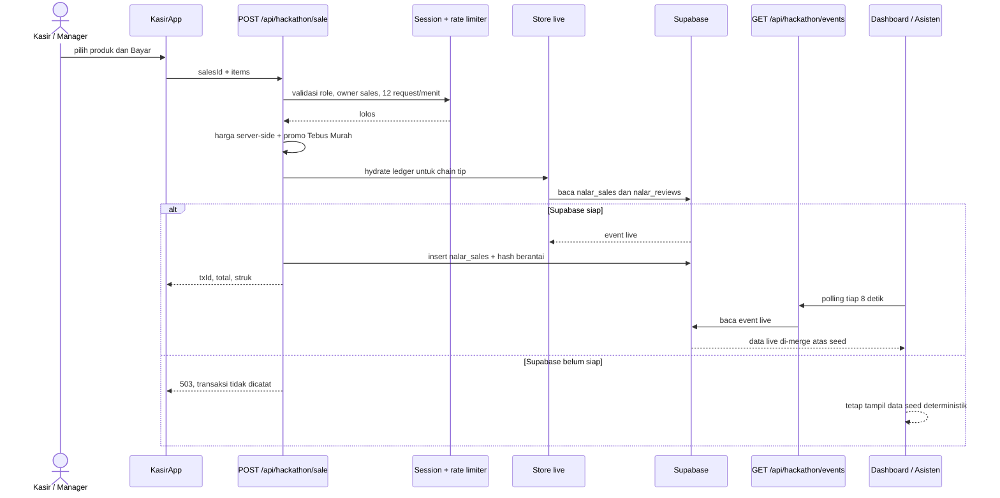

# Arsitektur, Data Flow, dan User Flow

Dokumen ini adalah peta cepat untuk tim yang ingin melanjutkan pengembangan NALAR × SAKSI. Diagram memakai Mermaid dan dapat dirender langsung di GitHub. Untuk batas layer, kontrak route/API, dan failure mode, lanjutkan ke [APP_ARCHITECTURE.md](./APP_ARCHITECTURE.md).

## 1. Arsitektur sistem

```mermaid
flowchart TB
    User[Pengunjung: publik, pelanggan, sales, manager, direktur]
    Proxy[src/proxy.ts\nURL bersih -> /hackathon/*]
    App[Next.js 16 App Router\nServer + Client Components]

    User --> Proxy --> App
    App --> Public[Landing, pelanggan, verifikasi, nasional]
    App --> Login[Login server action\nrole session cookie]
    Login --> RBAC[RBAC: manager, sales, direktur]
    RBAC --> Ops[Dashboard, Kasir, Asisten]

    subgraph StoreOps[SAKSI + NALAR Gerai]
        Seed[Seed deterministik + analytics\nledger hash, KPI, prediksi]
        Sale[POST /api/hackathon/sale]
        Events[GET /api/hackathon/events]
        Supabase[(Supabase\nnalar_sales + nalar_reviews)]
        Gemini[Gemini server-side\nnarasi grounded]
    end

    Ops --> Seed
    Ops --> Sale --> Supabase
    Supabase --> Events --> Ops
    Ops --> Gemini

    subgraph National[NALAR Nasional]
        NationalUI[/nasional + detail Kopdes]
        Bundle[getNationalBundle\nunstable_cache: 10 menit]
        SharedDB[(PostgreSQL panitia\nSSL, read-only, pool kecil)]
        Snapshot[NATIONAL_SNAPSHOT\nfallback bawaan]
        Map[Leaflet + OpenStreetMap\npin, popup, heat layer]
        Svg[SVG scatter fallback]
    end

    Public --> NationalUI --> Bundle
    Bundle --> SharedDB
    SharedDB -. DB tidak tersedia / kosong .-> Snapshot --> Bundle
    NationalUI --> Map
    Map -. Leaflet gagal .-> Svg

    Supabase -. tidak tersedia .-> Seed
    Gemini -. key/API gagal .-> Template[Template deterministik]
```

Catatan penting:

- Database panitia hanya dibaca melalui adapter `pg` yang memakai `default_transaction_read_only=on`.
- Detail Kopdes memakai bundle nasional yang sudah di-cache; klik pin tidak membuat query DB per koperasi.
- Peta aktif saat ini memakai OpenStreetMap, sehingga tidak membutuhkan Google Maps API key. Tombol pada detail dapat membuka Google Maps eksternal dari koordinat.

## 2. Data flow operasional: POS sampai insight live



## 3. Data flow nasional dan AI

```mermaid
flowchart LR
    DB[(DB Panitia)] -->|SSL, read-only, timeout| Bundle[getNationalBundle\ncache 10 menit]
    Bundle -->|live| National[/nasional\nfilter di browser]
    DB -. gagal / kosong .-> Snapshot[NATIONAL_SNAPSHOT] -->|live = false| Bundle
    National --> Pin[Klik pin Leaflet]
    Pin --> Detail[/nasional/koperasi/:ref]
    Detail --> External[Google Maps eksternal\nopsional bila ada koordinat]

    Director[Direktur pilih quick prompt] --> Ask[askAssistant server action]
    Ask --> Hydrate[hydrateLive dari Supabase]
    Hydrate --> Facts[analytics + fakta teratestasi]
    Facts --> HasKey{GEMINI_API_KEY ada?}
    HasKey -- Ya --> Model[Gemini: hanya merangkai fakta]
    Model --> Valid{respons valid?}
    Valid -- Ya --> Reply[Jawaban AI]
    Valid -- Tidak/error --> Template[Template deterministik]
    HasKey -- Tidak --> Template
```

## 4. User flow dan hak akses

```mermaid
flowchart TD
    Start[Pengunjung] --> Landing[Landing /]
    Landing --> Verify[/verifikasi\ncek keaslian struk]
    Landing --> Customer[/pelanggan\nstruk, loyalti, ulasan]
    Landing --> National[/nasional\nmonitoring Kopdes]
    Landing --> Login[/login]

    Login -->|manager| Manager[/dashboard\nBI penuh]
    Login -->|sales| Sales[/dashboard\nperforma sendiri]
    Login -->|direktur| Director[/asisten\nquick prompt AI]

    Manager --> ManagerPOS[/kasir\nbisa pilih sales]
    Sales --> SalesPOS[/kasir\nsalesId terkunci]
    Manager --> Assistant[/asisten\nopsional]
    Director --> Assistant
    Assistant --> Report[Jawaban grounded + unduh rekap]

    ManagerPOS --> Receipt[/pelanggan/struk/:txId]
    SalesPOS --> Receipt
    Customer --> Receipt
    Receipt --> Review[Rating + komentar]
    Receipt --> Verify

    National --> Filters[Filter provinsi, sektor, status]
    Filters --> Map[Klik pin koperasi]
    Map --> Detail[/nasional/koperasi/:ref\nPusat Informasi]
    Detail --> Directions[Link Google Maps bila koordinat tersedia]
```

| Area | Akses |
|---|---|
| `/nasional`, detail Kopdes, `/pelanggan`, `/verifikasi` | Publik |
| `/dashboard` | Manager dan sales; sales hanya melihat data sendiri |
| `/kasir` | Manager dan sales; direktur ditolak |
| `/asisten` | Pengguna yang sudah login; direktur diarahkan ke sini setelah login |

## 5. Peta file: mulai edit dari mana

### Root, konfigurasi, dan deployment

| File | Tanggung jawab |
|---|---|
| `README.md` | Ringkasan produk, quick start, akun demo, dan tautan dokumentasi. |
| `ARCHITECTURE.md` | Diagram Mermaid, user flow, data flow, dan katalog file ini. |
| `WALKTHROUGH.md` | Setup environment, Supabase, deploy Netlify, dan alur demo juri. |
| `.env.example` | Daftar semua environment variable tanpa nilai rahasia. |
| `package.json` | Script proyek dan dependency runtime/development. |
| `package-lock.json` | Versi dependency yang dikunci npm. Jangan edit manual. |
| `next.config.ts` | Konfigurasi Next.js. |
| `netlify.toml` | Build environment dan plugin Next.js untuk Netlify. |
| `postcss.config.mjs` | Pipeline PostCSS/Tailwind. |
| `tsconfig.json` | Strict TypeScript dan alias `@/* -> src/*`. |
| `vitest.config.ts` | Konfigurasi runner test Vitest. |
| `src/proxy.ts` | Rewrite URL publik bersih ke namespace internal `/hackathon/*`. |

### App shell, API, dan komponen bersama

| File | Tanggung jawab |
|---|---|
| `src/app/layout.tsx` | Root layout Next.js di luar microsite. |
| `src/app/page.tsx` | Entry root sebelum rewrite microsite. |
| `src/app/globals.css` | Gaya global dan utility lintas halaman. |
| `src/app/hackathon/layout.tsx` | Font, metadata, design token, dan shell visual NALAR. |
| `src/app/hackathon/page.tsx` | Landing/product narrative NALAR × SAKSI. |
| `src/app/api/hackathon/sale/route.ts` | Endpoint POS: auth, rate limit, harga server-side, promo, hash chain, dan insert transaksi. |
| `src/app/api/hackathon/events/route.ts` | Endpoint polling untuk event POS/review live. |
| `src/app/hackathon/_components/Charts.tsx` | Chart SVG interaktif yang dipakai dashboard/nasional. |
| `src/app/hackathon/_components/LogoutButton.tsx` | Tombol logout shared. |

### Auth, dashboard, POS, dan asisten

| File | Tanggung jawab |
|---|---|
| `src/app/hackathon/login/page.tsx` | Halaman login dan redirect menurut role. |
| `src/app/hackathon/login/LoginForm.tsx` | Form login client. |
| `src/app/hackathon/login/actions.ts` | Server action autentikasi dan pembuatan cookie sesi. |
| `src/app/hackathon/dashboard/page.tsx` | Guard server untuk dashboard lalu memuat data awal. |
| `src/app/hackathon/dashboard/DashboardApp.tsx` | BI manager/sales, filter, chart, dan polling event tiap 8 detik. |
| `src/app/hackathon/kasir/page.tsx` | Guard role manager/sales untuk halaman kasir. |
| `src/app/hackathon/kasir/KasirApp.tsx` | Keranjang POS dan request ke endpoint sale. |
| `src/app/hackathon/asisten/page.tsx` | Guard halaman asisten dan data awal. |
| `src/app/hackathon/asisten/AssistantApp.tsx` | UI quick prompt, polling insight, dan unduh rekap. |
| `src/app/hackathon/asisten/actions.ts` | Server action `askAssistant`; Gemini opsional dengan fallback template. |

### Pelanggan dan verifikasi publik

| File | Tanggung jawab |
|---|---|
| `src/app/hackathon/pelanggan/page.tsx` | Halaman customer demo, riwayat struk, loyalti, dan insight. |
| `src/app/hackathon/pelanggan/PelangganInsights.tsx` | Visual insight belanja, badge, dan dampak SHU pelanggan. |
| `src/app/hackathon/pelanggan/ReceiptList.tsx` | Daftar dan filter struk pelanggan. |
| `src/app/hackathon/pelanggan/actions.ts` | Server action pengiriman rating/komentar. |
| `src/app/hackathon/pelanggan/struk/[txId]/page.tsx` | Detail satu struk beserta status hash. |
| `src/app/hackathon/pelanggan/struk/[txId]/ReceiptActions.tsx` | Kontrol client untuk rating dan aksi detail struk. |
| `src/app/hackathon/verifikasi/page.tsx` | Halaman publik cek keaslian transaksi. |
| `src/app/hackathon/verifikasi/VerifyForm.tsx` | Form input ID transaksi dan simulasi tamper. |
| `src/app/hackathon/verifikasi/actions.ts` | Server action verifikasi hash setelah hydrate data live. |

### Nasional dan peta Kopdes

| File | Tanggung jawab |
|---|---|
| `src/app/hackathon/nasional/page.tsx` | Memuat bundle nasional dan audit DB untuk dashboard nasional. |
| `src/app/hackathon/nasional/NasionalView.tsx` | KPI, filter browser-side, chart, dan komposisi halaman nasional. |
| `src/app/hackathon/nasional/KoperasiMap.tsx` | Leaflet, OpenStreetMap, marker/popup, heat layer, serta fallback SVG. |
| `src/app/hackathon/nasional/koperasi/[ref]/page.tsx` | Pusat Informasi per Kopdes dari `ref` bundle cache; link arah eksternal bila ada koordinat. |

### Domain, data, dan service layer

| File | Tanggung jawab |
|---|---|
| `src/lib/supabase.ts` | Membuat Supabase admin client dari server-side environment. |
| `src/lib/hackathon/auth.ts` | Tipe role, akun demo, aturan akses, dan cookie session. |
| `src/lib/hackathon/session.ts` | Membaca sesi dari request API. |
| `src/lib/hackathon/rate-limit.ts` | Rate limiter in-memory untuk sale/review. |
| `src/lib/hackathon/seed.ts` | Seed deterministik: koperasi, produk, pegawai, ledger, hash, dan data runtime live. |
| `src/lib/hackathon/store.ts` | Adapter Supabase untuk sales/reviews dan hydrate data live ke seed runtime. |
| `src/lib/hackathon/analytics.ts` | Fungsi murni KPI, insight, forecast, rekomendasi, dan verifikasi struk. |
| `src/lib/hackathon/assistant.ts` | Fakta dan template jawaban quick prompt direktur. |
| `src/lib/hackathon/customer.ts` | Read model struk pelanggan, poin, tier, dan loyalti. |
| `src/lib/hackathon/schema.ts` | Tipe/schema domain yang digunakan lintas modul. |
| `src/lib/hackathon/db.ts` | Pool PostgreSQL panitia read-only dan audit kesiapan DB. |
| `src/lib/hackathon/national.ts` | Query agregat nasional, cache 10 menit, snapshot fallback, dan lookup Kopdes per `ref`. |
| `src/lib/hackathon/national-snapshot.ts` | Snapshot nasional tertanam untuk kondisi DB tidak tersedia. |
| `src/lib/hackathon/ml.ts` | Model interpretable untuk prediksi/konversi promo. |

### Database, asset, dan test

| File | Tanggung jawab |
|---|---|
| `supabase/migrations/0001_nalar_tables.sql` | Migrasi tabel live `nalar_sales` dan `nalar_reviews`. |
| `supabase-setup.sql` | Skrip setup Supabase siap tempel untuk operator. |
| `public/nalar-logo.jpg` | Asset logo NALAR. |
| `src/lib/hackathon/analytics.test.ts` | Test perhitungan analytics inti. |
| `src/lib/hackathon/degradation.test.ts` | Test fallback aman saat env/integrasi eksternal tidak tersedia. |
| `src/lib/hackathon/model-eval.test.ts` | Evaluasi reproducible kualitas model/prediksi. |
| `src/lib/hackathon/promo-model.test.ts` | Test classifier promo conversion. |

## 6. Titik aman saat melanjutkan

- Jangan menulis ke database panitia; data tim yang mutable tetap berada di Supabase.
- Tambahkan sumber fakta baru ke analytics sebelum dipakai prompt Gemini.
- Pertahankan fallback seed, snapshot nasional, dan template AI saat menambah integrasi eksternal.
- Jalankan `npx tsc --noEmit`, `npm test`, dan `npm run build` sebelum push.
